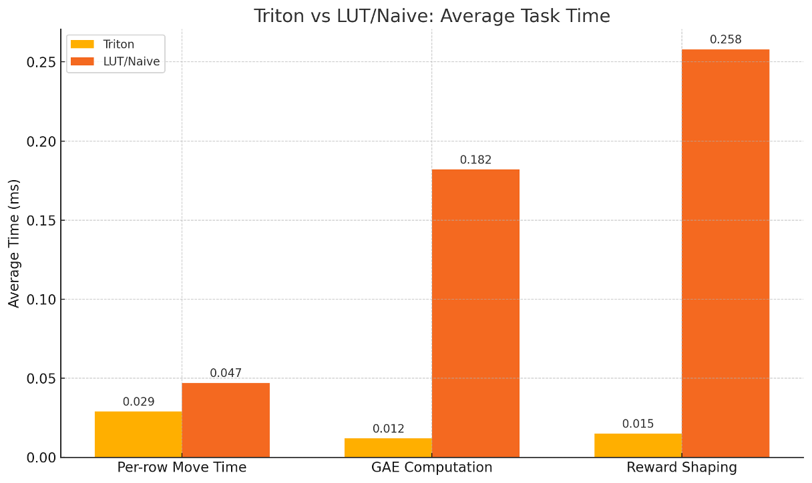
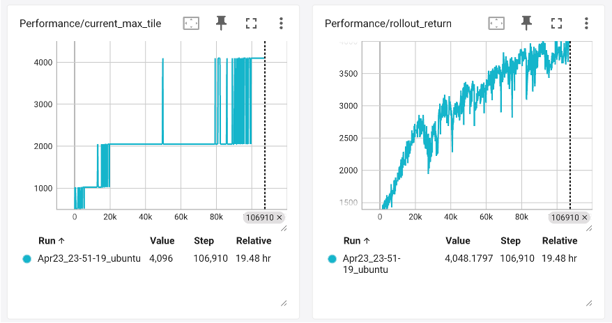

# Tensor PPO 2048




A PyTorch implementation of Proximal Policy Optimization (PPO) for playing 2048, with optimizations including Triton kernels, Fully-vectorized environment, LUT tables, etc. Compare to other Github naive implementations, our method boosts the performance by 76 times. In one day of trainning time, our policy can consistently reach 4096.
We attribute our success to the power of scaling law and data-driven RL.

## Authorship
This repo contains code for the Final Project of STATS-303 Statistical Machine Learning at Duke KunShan University.
Author: Shengyang Wang, Xudong Chen

## Directory Structure

```
.
├── models/           # Trained model checkpoints (.pth files)
├── plots/           # Performance plots and visualizations
├── tests/           # Test files
├── ppo2048.py      # Main PPO implementation
├── vector2048_env.py # Vectorized 2048 environment
├── evaluate.py      # Evaluation script
├── triton_kernels.py # Triton kernel implementations
├── mpc2048.py      # Model Predictive Control implementation
├── dqn2048.py      # DQN implementation
├── random2048.py   # Random policy implementation
├── ablation.py     # Ablation study script
├── benchmark.py    # Performance benchmarking
└── requirements.txt # Python dependencies
```

## Usage

1. Training PPO:
```bash
python ppo2048.py # On a single GPU, --com_reward if you want to enable a more sophisticated reward (Performance not increasing much)
```
Or with multiple gpu:
```bash
torchrun --nproc_per_node=8
```
2. Evaluating a trained model:
```bash
python evaluate.py --policy ppo --ppo-model models/ppo2048_final.pth
```

3. Running tests:
```bash
python -m pytest tests/
```

## Model Files

Trained models are stored in the `models/` directory:
- `ppo2048_final.pth`: Final trained PPO model
- `dqn2048.pth`: Trained DQN model
- Intermediate checkpoints: `ppo2048_epN.pth`

## Performance Plots

Training and evaluation plots are saved in the `plots/` directory:
- `*_reward_plot.png`: Reward curves
- `*_maxtile_plot.png`: Maximum tile achieved
- `*_tile_distribution.png`: Tile distribution statistics

## Installation

1. Create a conda/venv and install:
   ```bash
   pip install -r requirements.txt
   ```

## Single‑GPU (or CPU/MPS) Training

```bash
python ppo2048.py
```

This will use CUDA if available, else MPS (on Apple Silicon), else CPU.

## Multi‑GPU Distributed Training

Ensure you have `torchrun` (PyTorch >=1.9).

Example: train on 8 GPUs:

```bash
torchrun --nproc_per_node=8 ppo2048.py
```

- This will automatically set `WORLD_SIZE=8` and `LOCAL_RANK` for each process.
- The script splits `4096` envs evenly across GPUs (`4096/8=512` envs per GPU).
- Only the _rank 0_ process prints logs and saves the model (`ppo2048.pth`).

## Evaluation

```bash
python evaluate.py
```

Plays one greedy game and renders with Pygame.

## TensorBoard Logging

During training the script logs a wealth of metrics to TensorBoard via `SummaryWriter`, stored under the default `runs/` directory.

To launch TensorBoard (from the project root):
```bash
tensorboard --logdir=runs
```

Available metrics:
- **Performance/avg_return**: mean episode return
- **Performance/max_tile**: maximum tile reached in the batch
- **Loss/policy**: average policy loss per PPO epoch
- **Loss/value**: average value loss per PPO epoch
- **Loss/entropy**: average policy entropy per PPO epoch
- **Distributions/returns**, **Distributions/advantages**, **Distributions/actions**: histograms of batched returns, advantages, and chosen actions 

## How to Cite

If you use this codebase in your research or projects, please cite it as follows:

```
@misc{TensorPPO2048,
  author = {Shengyang Wang and Xudong Chen},
  title = {Tensor PPO 2048: A PyTorch implementation of Proximal Policy Optimization for 2048},
  year = {2024},
  howpublished = {\url{https://github.com/Wangshengyang2004/Tensor_PPO_2048}}
}
```

Repository: [https://github.com/Wangshengyang2004/Tensor_PPO_2048](https://github.com/Wangshengyang2004/Tensor_PPO_2048)

Authorship: Shengyang Wang, Xudong Chen 